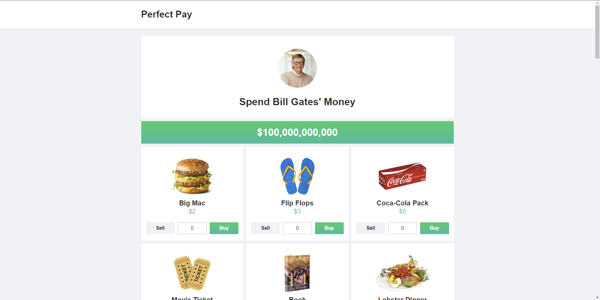

# [🚀 Perfect Pay - Front End Test](https://perfect-pay-test.herokuapp.com/)


<h2 align="center">☕ Projeto Concluído</h2>



> https://perfect-pay-test.herokuapp.com/ - Página Web Vue 3 Desenvolvida como Teste Front-End.

<br>

### Ajustes e melhorias

O projeto está em constante desenvolvimento, então as próximas atualizações serão voltadas nas seguintes tarefas:

- [x] Configurar Ambiente de Desenvolvimento.
- [x] Levantar Requisitos e Assets do Projeto.
- [x] Configurar SASS e Estilos da Aplicação.
- [x] Implementar Header
- [x] Implementar Main Container e Header do Container
- [x] Implementar Money Bar
- [x] Configurar Store e Methodos
- [x] Implementar Button
- [x] Implementar Market Item and Market List
- [x] Implementar Reciept
- [x] Implementar Footer
- [x] Responsividade.

## 📝 Pré-requisitos

Requisitos definidos pela empresa:

- Desenvolva o site abaixo em VUE, com atenção na reatividade dos elementos da página.
  - https://neal.fun/spend/
- Utilizar Vuex;
- Estilizar utilizando SASS;
- Utilizar arquitetura BEM no CSS.

Será avaliado:

- Criação de Componentes;
- Estrutura de código;
- Organização do projeto;
- Funcionalidade.

## ⚙️ Instalando o Projeto

Siga estas etapas:

```
npm install

npm run serve
```

## 💻 Feito Com:


## 🤝 Desenvolvido Por

<table>
  <tr>
    <td align="center">
      <a href="https://github.com/pumba-dev">
        <br>
        <sub>
          <b>Eu Mesmo</b>
        </sub>
      </a>
    </td>
  </tr>
</table>

[](https://www.linkedin.com/in/pumba-dev/)

## 😄 Seja um dos Contribuidores<br>

Entre em contato para se tornar um contribuidor.

## 💰 Donate

[](https://picpay.me/pumbadev)
[](https://nubank.com.br/pagar/1ou9f/ifu2K7YNO7)

## 📝 Licença

Copyright © 2022 Pumba Developer
